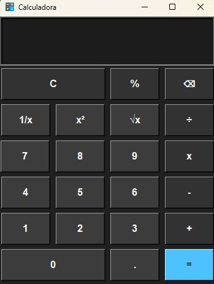
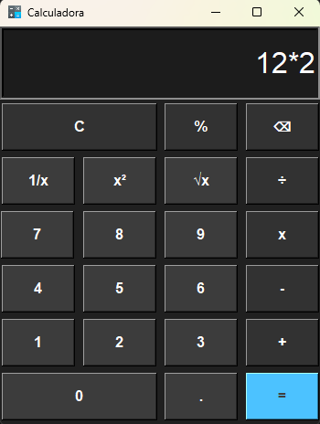

# Calculadora em Python com interface gráfica

<p align="left">
<!--      -->
    
    

</p>

Calculadora simples em Python com interface gráfica.

## 🔨 Funcionalidades do projeto
- Adição
- Subtração
- Multiplicação
- Divisão
- Raiz quadrada
- Potência ao quadrado
- Recíproco

<br>

<div display: inline_block align="center">
  
  
</div>

<br>

## 📁 Acesso ao projeto
- [Acessar projeto](https://github.com/EricFilipeF/calculadora-em-python)
- [Baixar projeto](https://github.com/EricFilipeF/calculadora-em-python/archive/refs/heads/main.zip)

<br>

## 🛠️ Execução do projeto
- [Fazer instalação do Python](https://www.python.org/downloads/) caso ainda não tenha instalado.
- Ao baixar o projeto, abra o projeto no [Visual Studio Code](https://code.visualstudio.com/).
- Com o projeto aberto no VS Code, abra um terminal dentro do VS Code e execute o seguinte comando
```bash
python calculadora_com_interface.py
```

<br>

## 🧑‍💻 Ferramentas utilizadas
- `Visual Studio Code`
-  `Python 3.11.9`
-  `Tkinter 8.6`

<br>

## 🤝 Contribuições
Contribuições são bem-vindas! Abra uma issue ou pull request.
